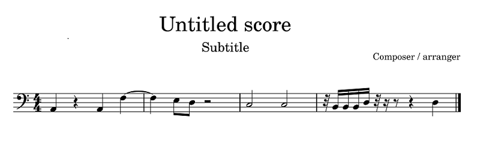
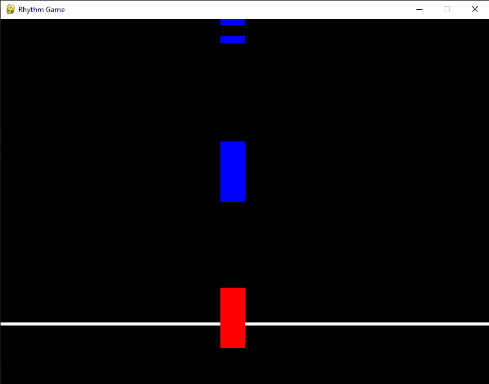

# Python Script: `falling_notes.py`

## Overview

`falling_notes.py` is a Python script for visualizing the rhythm of musical notes. It serves as a minimalistic *musicgram*.

The script processes a track from a MIDI file, plays the file, and visualizes the notes falling in a style reminiscent of "Piano Hero." 

The project includes a sample MIDI file with a single track. This file is hardcoded into the script for demonstration purposes.



### Visualization Features
- Notes are represented as **rectangles**.
- **Timing**: A note is played when its rectangle reaches the bottom line.
- **Duration**: The rectangle's height is proportional to the note's duration.
- **Strong Beats**: Strong beats are highlighted in **red**.




## Requirements

Before using the script, ensure the following requirements are met:

- **Python**: Version 3.8 or higher
- **Required Python libraries**:
  - `mido`
  - `pygame`


## Installation

### Step 1: Clone the Repository
Clone the repository to your local machine:
```bash
git clone https://github.com/cogollud/falling_notes.git
cd repo_name
```

### Step 2: Install the required libraries
```
pip install mido
pip install pygame
```

## Run
```
python falling_notes.py
```


### Using Custom MIDI Files
To visualize a different MIDI file:

Use a MIDI editor like MuseScore to create or edit a MIDI file.
Replace the hardcoded file name in falling_notes.py with your custom file.


```
if __name__ == "__main__":    
    # Load the MIDI file into the Song object
    midi_file = "simple.mid"
    song = midi_parser.Song(midi_file)
    print(song) # Print the song information

    # build fallingNotes from the notes of the first track (ignoring the rest of the tracks)
    track = song.tracks[0] 
    fallingNotes = [FallingNote(SCREEN_WIDTH // 2, note) for note in track.notes]

    main_game(midi_file, fallingNotes)
```

## Extend the functionality

This script is just a toy.
It only shows the first track, but with a little effort it could show multiple tracks as Piano Hero.
